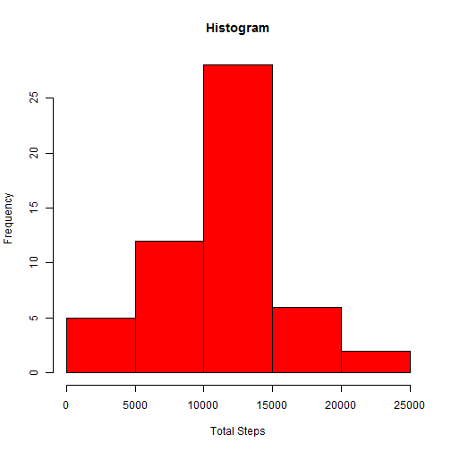
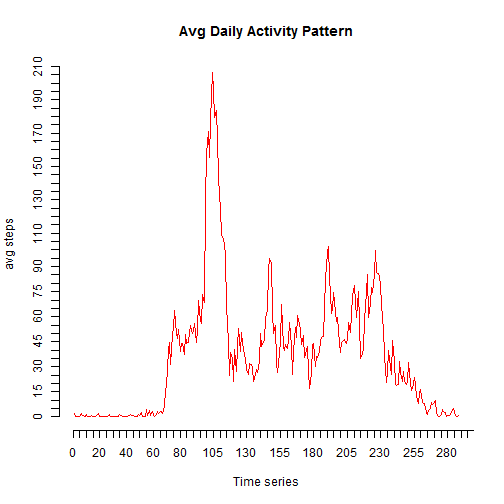
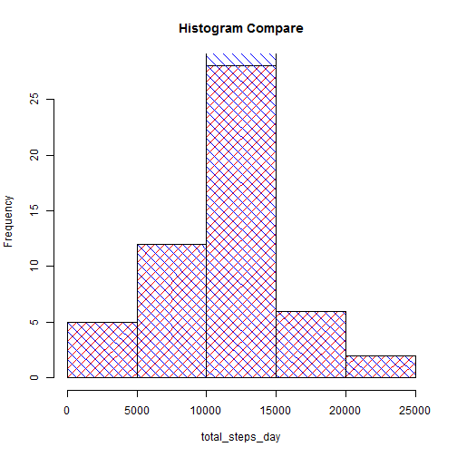
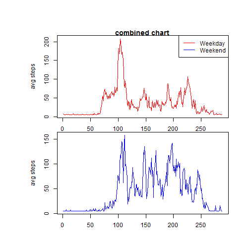

This is an R Markdown document. 

# Peer Assessment 1  

## Load Libraries  


```r
# Libraries needed for this project
library(knitr)
library(lubridate)
library(ggplot2)
library(plyr)
library(dplyr)
library(scales)
library(timeDate)
library(lattice)
library(reshape2)
```

## Set Options  


```r
opts_chunk$set(echo=TRUE)
```

## Load and process data  


```r
#Import from CSV
fulldata<-read.csv("activity.csv",stringsAsFactors = FALSE,header = TRUE,na.strings = "NA")
fulldata$date <- mdy(fulldata$date)
```

## Mean total number of steps per day  

```r
# This caclculates the total number of steps per day(and draws a histogram), mean and meadian of total steps taken per day
data_omitna <- na.omit(fulldata)
total_steps_day<-tapply(data_omitna$steps, data_omitna$date, FUN=sum)
total_steps_day_mean<-tapply(data_omitna$steps, data_omitna$date, FUN=mean)
total_steps_day_median<-tapply(data_omitna$steps, data_omitna$date, FUN=median)
hist(total_steps_day,main="Histogram",xlab="Total Steps",ylab="Frequency",col="red")
```

 
  
The MEAN of total number of steps taken per day: 0.4375, 39.4166667, 42.0694444, 46.1597222, 53.5416667, 38.2465278, 44.4826389, 34.375, 35.7777778, 60.3541667, 43.1458333, 52.4236111, 35.2048611, 52.375, 46.7083333, 34.9166667, 41.0729167, 36.09375, 30.6284722, 46.7361111, 30.9652778, 29.0104167, 8.6527778, 23.5347222, 35.1354167, 39.7847222, 17.4236111, 34.09375, 53.5208333, 36.8055556, 36.7048611, 36.2465278, 28.9375, 44.7326389, 11.1770833, 43.7777778, 37.3784722, 25.4722222, 0.1423611, 18.8923611, 49.7881944, 52.4652778, 30.6979167, 15.5277778, 44.3993056, 70.9270833, 73.5902778, 50.2708333, 41.0902778, 38.7569444, 47.3819444, 35.3576389, 24.46875    

The MEDIAN of total number of steps taken per day: 0, 0, 0, 0, 0, 0, 0, 0, 0, 0, 0, 0, 0, 0, 0, 0, 0, 0, 0, 0, 0, 0, 0, 0, 0, 0, 0, 0, 0, 0, 0, 0, 0, 0, 0, 0, 0, 0, 0, 0, 0, 0, 0, 0, 0, 0, 0, 0, 0, 0, 0, 0, 0 /* The median is zero */     

## Average daily activity pattern  

```r
#This calculates the average daily activity pattern and plot a line graph
avg_steps_5minint_alldays<-tapply(data_omitna$steps,data_omitna$interval,mean)
plot(avg_steps_5minint_alldays, type='l', axes=FALSE,xlab="Time series",ylab="avg steps",main="Avg Daily Activity Pattern",col="red")
axis(side=1, at=seq(0, 2355, by=5))
axis(side=2,at=seq(0,210,by=5))
```

 

```r
max_steps_alldays<-round(max(avg_steps_5minint_alldays))

avg_steps_5minint_alldays_df<-as.data.frame(avg_steps_5minint_alldays)

#classint<-class(avg_steps_5minint_alldays_df)

interval_max_steps<-avg_steps_5minint_alldays_df[which.max(avg_steps_5minint_alldays_df$steps), ]
```
   
Maximum STEPS at 5 minute Interval - all days avg: 206  

  

## Imputing Missing Values  


```r
#to find total number of missing values( with NAs) in the data set
sum_na_rows<-sum(is.na(fulldata))


#subset of NA data only
data_onlyna <- subset(fulldata, is.na(fulldata$steps))

#mean is found for the data set and applied to NA values 
data_onlyna$steps<-mean(data_omitna$steps)

#summarize data
#data_mean_summarize<-ddply(data_omitna,~interval,summarise,mean=mean(steps))

#NA and Non-NA (Valid) data sets are row binded and arranged by date
fulldata_postimputing<-rbind(data_omitna,data_onlyna)
fulldata_postimputing<-arrange(fulldata_postimputing,date)
total_steps_day_new<-tapply(fulldata_postimputing$steps, fulldata_postimputing$date, FUN=sum)
total_steps_day_mean_new<-tapply(fulldata_postimputing$steps, fulldata_postimputing$date, FUN=mean)
total_steps_day_median_new<-tapply(fulldata_postimputing$steps, fulldata_postimputing$date, FUN=median)

#Drawing two histograms to compare
hist1<-hist(total_steps_day,plot=FALSE)
hist2<-hist(total_steps_day_new,plot=FALSE)
#plot(0,0,type="n",xlim=c(0,25000),ylim=c(0,50),xlab="Total Steps",ylab="Frequency",main="Histogram Compare")
plot(hist1,col="red",density=10,angle=45,main="Histogram Compare")
plot(hist2,col="blue",density=10,angle=135,add=TRUE)
```

 

**Mean Imputing strategy: Mean is found for the data set and applied to NA values**

Total number of missing values(NAs) in the data set: 2304   

Total Number of steps MEAN: 37.3825996, 0.4375, 39.4166667, 42.0694444, 46.1597222, 53.5416667, 38.2465278, 37.3825996, 44.4826389, 34.375, 35.7777778, 60.3541667, 43.1458333, 52.4236111, 35.2048611, 52.375, 46.7083333, 34.9166667, 41.0729167, 36.09375, 30.6284722, 46.7361111, 30.9652778, 29.0104167, 8.6527778, 23.5347222, 35.1354167, 39.7847222, 17.4236111, 34.09375, 53.5208333, 37.3825996, 36.8055556, 36.7048611, 37.3825996, 36.2465278, 28.9375, 44.7326389, 11.1770833, 37.3825996, 37.3825996, 43.7777778, 37.3784722, 25.4722222, 37.3825996, 0.1423611, 18.8923611, 49.7881944, 52.4652778, 30.6979167, 15.5277778, 44.3993056, 70.9270833, 73.5902778, 50.2708333, 41.0902778, 38.7569444, 47.3819444, 35.3576389, 24.46875, 37.3825996   

Total number of steps MEDIAN: 37.3825996, 0, 0, 0, 0, 0, 0, 37.3825996, 0, 0, 0, 0, 0, 0, 0, 0, 0, 0, 0, 0, 0, 0, 0, 0, 0, 0, 0, 0, 0, 0, 0, 37.3825996, 0, 0, 37.3825996, 0, 0, 0, 0, 37.3825996, 37.3825996, 0, 0, 0, 37.3825996, 0, 0, 0, 0, 0, 0, 0, 0, 0, 0, 0, 0, 0, 0, 0, 37.3825996    

**As the histogram compare clearly shows, plot 2 in blue color has INCREASED frequency, especially in the middle, indicating IMPUTING mean of the data set to NAs has surely affected the output, as expected.** 

## Weekday and Weekend activity pattern  


```r
# subsets weekday data
data_weekday <- subset(fulldata_postimputing, isWeekday(fulldata_postimputing$date,wday=1:5))

# calculates avg steps on weekdays
avg_steps_weekday<-tapply(data_weekday$steps,data_weekday$interval,mean)

max_steps_weekday<-round(max(avg_steps_weekday))

# subsets weekend data
data_weekend <- subset(fulldata_postimputing, isWeekend(fulldata_postimputing$date,wday=1:5))

# calculates avg steps on weekends
avg_steps_weekend<-tapply(data_weekend$steps,data_weekend$interval,mean)

max_steps_weekend<-round(max(avg_steps_weekend))
```

maximum steps on Weekdays: 208  
maximum steps on Weekends: 158  


```r
par(mfrow= c(2,1))
par(mar = c(1,4, 1, 1), oma = c(4, 4, 4, 2))

plot(avg_steps_weekday, type='l', axes=TRUE,main="combined chart",ylab="avg steps",col="red")


legendnames<-c("Weekday","Weekend")
        legend('topright', legendnames, lty=1, col=c('red', 'blue'))


plot(avg_steps_weekend, type='l', axes=TRUE,ylab="avg steps",col="blue")
```

 
